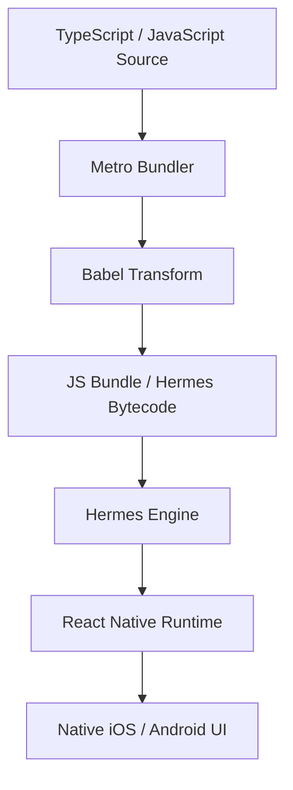
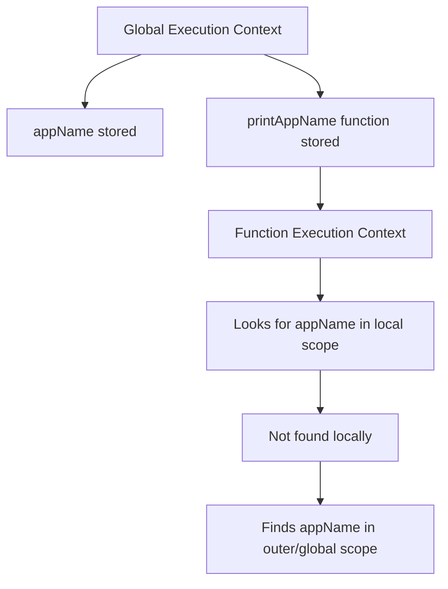
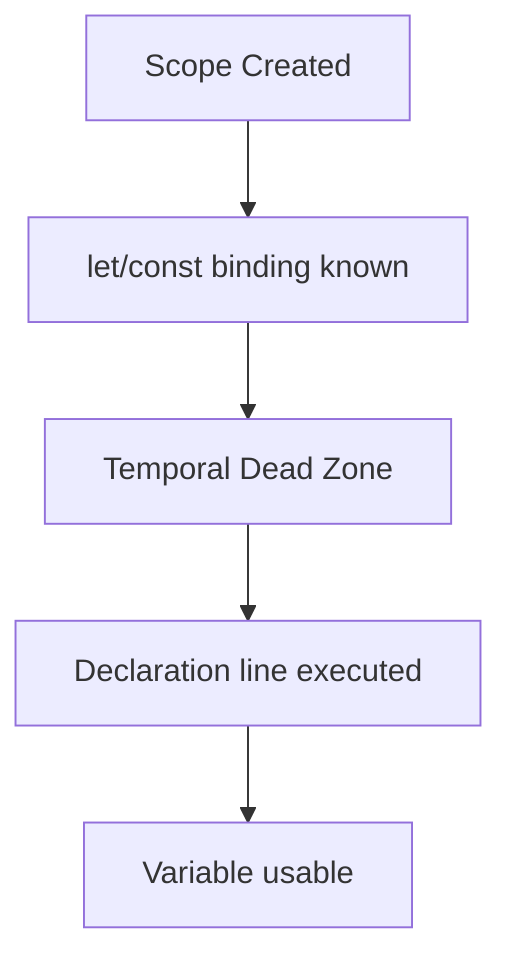
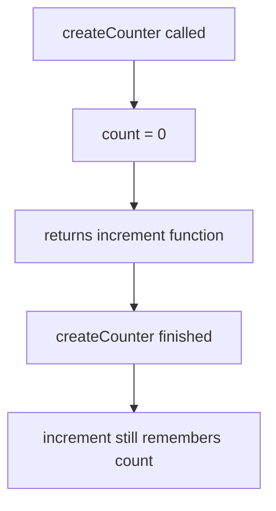
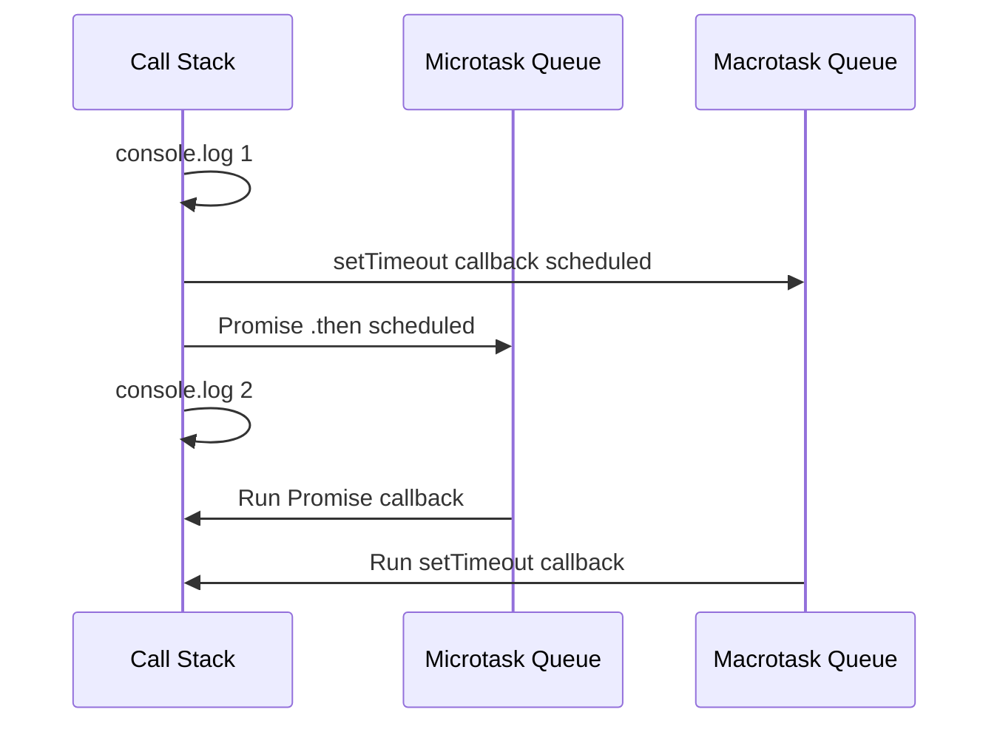
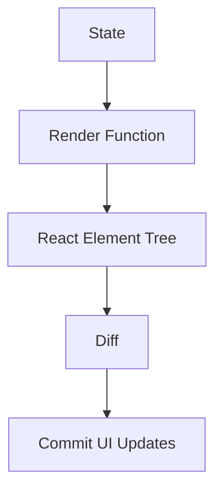
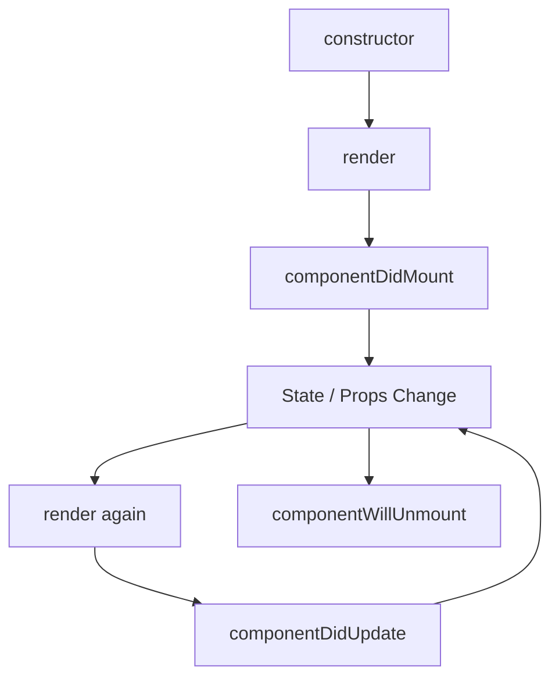
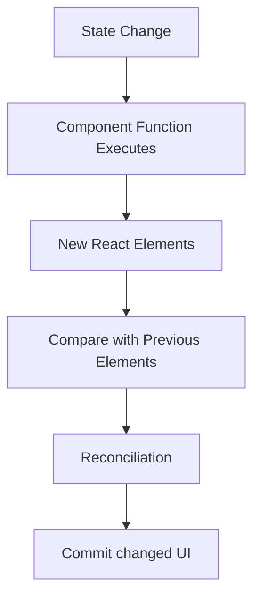

# React Native Senior Developer Handbook - Volume 1
## JavaScript, TypeScript, React, Class Components, Function Components, Hooks

> Goal: Refresh the foundation properly for senior React Native interviews.
> This volume focuses on JavaScript, TypeScript, React rendering, class components, function components, hooks, lifecycle mapping, closures, promises, event loop, immutability, and interview explanations.

---

# Table of Contents

1. How JavaScript Runs in React Native
2. Execution Context
3. Scope
4. Hoisting
5. `var` vs `let` vs `const`
6. `==` vs `===`
7. Closures
8. Closures in React
9. Event Loop
10. Promise Internals
11. Async/Await
12. Error Handling
13. Immutability
14. Shallow Copy vs Deep Copy
15. TypeScript Basics
16. TypeScript for React Native
17. Generics
18. Utility Types
19. Discriminated Unions
20. React Mental Model
21. JSX
22. Props
23. State
24. Controlled Components
25. Class Components
26. Class Lifecycle
27. Function Components
28. Hooks
29. `useState`
30. `useEffect`
31. `useMemo`
32. `useCallback`
33. `useRef`
34. Custom Hooks
35. Class to Hooks Migration
36. React Rendering and Reconciliation
37. Keys
38. Common Re-render Bugs
39. Senior Interview Q&A

---

# 1. How JavaScript Runs in React Native

React Native runs JavaScript using a JavaScript engine.

Modern React Native commonly uses Hermes.



Senior explanation:

> In React Native, JavaScript is responsible for business logic, React rendering, state management, and calling native APIs. The final UI is native, not HTML.

---

# 2. Execution Context

Whenever JavaScript runs code, it creates an execution context.

Execution context contains:

- Variable environment
- Scope chain
- `this` binding

Example:

```js
const appName = "Banking App";

function printAppName() {
  console.log(appName);
}

printAppName();
```

Flow:



Interview answer:

> Execution context is the environment where JavaScript code is evaluated. It defines what variables are available, what `this` points to, and how scope lookup works.

---

# 3. Scope

Scope decides where a variable is accessible.

## Global Scope

```js
const appName = "React Native App";

function logApp() {
  console.log(appName);
}
```

## Function Scope

```js
function calculateTotal() {
  const tax = 0.13;
  return tax;
}

console.log(tax); // ReferenceError
```

## Block Scope

```js
if (true) {
  let count = 10;
  const name = "Nithin";
}

console.log(count); // ReferenceError
```

Senior note:

> `let` and `const` are block scoped. `var` is function scoped, which can cause bugs in loops and async callbacks.

---

# 4. Hoisting

Hoisting means declarations are processed before code execution.

## `var` Hoisting

```js
console.log(a); // undefined

var a = 10;
```

Equivalent mental model:

```js
var a;

console.log(a); // undefined

a = 10;
```

## Function Declaration Hoisting

```js
sayHello();

function sayHello() {
  console.log("Hello");
}
```

This works because function declarations are hoisted with their body.

## Function Expression

```js
sayHello(); // TypeError or ReferenceError depending on var/let

const sayHello = function () {
  console.log("Hello");
};
```

## `let` and `const` Temporal Dead Zone

```js
console.log(name); // ReferenceError

let name = "Nithin";
```

`let` and `const` are hoisted but not initialized. The time before initialization is called the Temporal Dead Zone.



Senior interview answer:

> `var` is hoisted and initialized with `undefined`. `let` and `const` are hoisted but remain in the Temporal Dead Zone until the declaration line executes.

---

# 5. `var` vs `let` vs `const`

| Keyword | Scope | Reassign | Redeclare | Hoisted |
|---|---|---:|---:|---|
| `var` | Function | Yes | Yes | Yes, initialized as undefined |
| `let` | Block | Yes | No | Yes, TDZ |
| `const` | Block | No | No | Yes, TDZ |

Bad:

```js
for (var i = 0; i < 3; i++) {
  setTimeout(() => {
    console.log(i);
  }, 1000);
}
```

Output:

```txt
3
3
3
```

Good:

```js
for (let i = 0; i < 3; i++) {
  setTimeout(() => {
    console.log(i);
  }, 1000);
}
```

Output:

```txt
0
1
2
```

Why?

> `let` creates a new block-scoped binding for each loop iteration.

---

# 6. `==` vs `===`

`==` allows type coercion.

```js
0 == false;       // true
"5" == 5;         // true
null == undefined // true
```

`===` checks value and type.

```js
0 === false;       // false
"5" === 5;         // false
null === undefined // false
```

Real-world bug:

```js
const userId = "0";

if (userId == false) {
  console.log("No user");
}
```

This can behave unexpectedly.

Better:

```js
if (userId === "") {
  console.log("No user");
}
```

Senior rule:

> Use `===` by default. Use explicit conversion when needed.

```js
const count = Number(inputValue);

if (count === 0) {
  console.log("No items");
}
```

---

# 7. Closures

A closure is when a function remembers variables from its outer scope.

```js
function createCounter() {
  let count = 0;

  return function increment() {
    count += 1;
    return count;
  };
}

const counter = createCounter();

console.log(counter()); // 1
console.log(counter()); // 2
console.log(counter()); // 3
```

Diagram:



Senior explanation:

> Closures allow functions to preserve access to outer variables even after the outer function has finished execution.

---

# 8. Closures in React

Hooks rely heavily on closures.

Example:

```tsx
function Counter() {
  const [count, setCount] = useState(0);

  const logCount = () => {
    console.log(count);
  };

  return (
    <Button
      title="Log"
      onPress={logCount}
    />
  );
}
```

Each render creates a new `logCount` function that captures that render's `count`.

## Stale Closure Bug

```tsx
function Timer() {
  const [count, setCount] = useState(0);

  useEffect(() => {
    const id = setInterval(() => {
      console.log(count);
    }, 1000);

    return () => clearInterval(id);
  }, []);

  return (
    <Button
      title="Increment"
      onPress={() => setCount(count + 1)}
    />
  );
}
```

Problem:

`useEffect` dependency array is empty, so interval captures initial `count`.

Fix 1:

```tsx
useEffect(() => {
  const id = setInterval(() => {
    setCount(prev => prev + 1);
  }, 1000);

  return () => clearInterval(id);
}, []);
```

Fix 2:

```tsx
useEffect(() => {
  const id = setInterval(() => {
    console.log(count);
  }, 1000);

  return () => clearInterval(id);
}, [count]);
```

Senior explanation:

> In React, every render has its own props, state, and closures. Missing dependencies in hooks often create stale closure bugs.

---

# 9. Event Loop

JavaScript is single-threaded for executing JS code, but async operations are scheduled.

Priority:

1. Call stack
2. Microtasks
3. Macrotasks

```js
console.log("1 - sync");

setTimeout(() => {
  console.log("4 - timeout");
}, 0);

Promise.resolve().then(() => {
  console.log("3 - promise");
});

console.log("2 - sync");
```

Output:

```txt
1 - sync
2 - sync
3 - promise
4 - timeout
```

Diagram:



React Native relevance:

- Promise callbacks run as microtasks.
- Timers run later.
- Heavy JS blocks the JS thread.
- If JS thread is blocked, press handlers and state updates are delayed.

Bad:

```tsx
function blockThread() {
  const start = Date.now();

  while (Date.now() - start < 3000) {
    // blocks JS thread
  }
}
```

Better:

```tsx
InteractionManager.runAfterInteractions(() => {
  expensiveWork();
});
```

---

# 10. Promise Internals

Promise states:

```txt
pending → fulfilled
pending → rejected
```

Example:

```js
const promise = new Promise((resolve, reject) => {
  const success = true;

  if (success) {
    resolve("Loaded");
  } else {
    reject(new Error("Failed"));
  }
});

promise
  .then(value => {
    console.log(value);
  })
  .catch(error => {
    console.log(error.message);
  });
```

Promise chaining:

```js
fetchUser()
  .then(user => fetchAccounts(user.id))
  .then(accounts => fetchTransactions(accounts[0].id))
  .then(transactions => {
    console.log(transactions);
  })
  .catch(error => {
    console.log("Something failed", error);
  });
```

Senior explanation:

> A promise represents a future value. `.then` callbacks are scheduled as microtasks after the current call stack finishes.

---

# 11. Async/Await

`async/await` is syntactic sugar over promises.

Promise version:

```ts
function loadUser() {
  return userService
    .getUser("123")
    .then(user => {
      return user.name;
    });
}
```

Async version:

```ts
async function loadUser() {
  const user = await userService.getUser("123");
  return user.name;
}
```

Sequential calls:

```ts
async function loadDashboard() {
  const profile = await api.getProfile();
  const accounts = await api.getAccounts();
  const transactions = await api.getTransactions();

  return {
    profile,
    accounts,
    transactions,
  };
}
```

This is slow if calls are independent.

Parallel calls:

```ts
async function loadDashboard() {
  const [profile, accounts, transactions] = await Promise.all([
    api.getProfile(),
    api.getAccounts(),
    api.getTransactions(),
  ]);

  return {
    profile,
    accounts,
    transactions,
  };
}
```

Senior explanation:

> Use sequential await when calls depend on each other. Use `Promise.all` when calls are independent.

---

# 12. Error Handling

Bad:

```ts
async function loadUser() {
  const response = await fetch("/user");
  return response.json();
}
```

Better:

```ts
async function loadUser() {
  const response = await fetch("/user");

  if (!response.ok) {
    throw new Error(`Failed with status ${response.status}`);
  }

  return response.json();
}
```

Production API wrapper:

```ts
type ApiError = {
  status: number;
  message: string;
};

export async function request<T>(url: string): Promise<T> {
  const response = await fetch(url);

  if (!response.ok) {
    const error: ApiError = {
      status: response.status,
      message: "Request failed",
    };

    throw error;
  }

  return response.json();
}
```

Usage:

```ts
try {
  const user = await request<User>("/users/123");
  console.log(user);
} catch (error) {
  console.log("Show error state");
}
```

---

# 13. Immutability

React and Redux depend on reference comparison.

Bad mutation:

```ts
const user = {
  id: "1",
  name: "Old",
};

user.name = "New";
```

For React state, avoid mutation:

```tsx
const [user, setUser] = useState({
  id: "1",
  name: "Old",
});

user.name = "New"; // bad
setUser(user);     // same reference
```

Good:

```tsx
setUser(prev => ({
  ...prev,
  name: "New",
}));
```

Nested update:

```tsx
setUser(prev => ({
  ...prev,
  address: {
    ...prev.address,
    city: "Toronto",
  },
}));
```

Array update:

```tsx
setItems(prev =>
  prev.map(item =>
    item.id === selectedId
      ? { ...item, isSelected: true }
      : item
  )
);
```

Remove item:

```tsx
setItems(prev => prev.filter(item => item.id !== id));
```

Add item:

```tsx
setItems(prev => [...prev, newItem]);
```

Senior explanation:

> Immutability creates new references so React/Redux can detect changes and update the UI predictably.

---

# 14. Shallow Copy vs Deep Copy

Shallow copy:

```ts
const user = {
  name: "Nithin",
  address: {
    city: "Toronto",
  },
};

const copy = {
  ...user,
};

copy.address.city = "Scarborough";

console.log(user.address.city); // Scarborough
```

Why?

`address` object reference is shared.

Correct nested copy:

```ts
const copy = {
  ...user,
  address: {
    ...user.address,
    city: "Scarborough",
  },
};
```

Senior note:

> Spread creates a shallow copy. For nested objects, copy each level that changes.

---

# 15. TypeScript Basics

## Type Alias

```ts
type User = {
  id: string;
  name: string;
  email?: string;
};
```

## Interface

```ts
interface Product {
  id: string;
  title: string;
  price: number;
}
```

## Function Types

```ts
type OnUserPress = (userId: string) => void;

const onUserPress: OnUserPress = (userId) => {
  console.log(userId);
};
```

## Optional Fields

```ts
type Profile = {
  id: string;
  avatarUrl?: string;
};
```

Access safely:

```ts
const avatar = profile.avatarUrl ?? defaultAvatar;
```

---

# 16. TypeScript for React Native

Props:

```tsx
type UserCardProps = {
  id: string;
  name: string;
  onPress: (id: string) => void;
};

export function UserCard({ id, name, onPress }: UserCardProps) {
  return (
    <Pressable onPress={() => onPress(id)}>
      <Text>{name}</Text>
    </Pressable>
  );
}
```

State:

```tsx
type User = {
  id: string;
  name: string;
};

const [user, setUser] = useState<User | null>(null);
```

Navigation params:

```ts
type RootStackParamList = {
  Home: undefined;
  Profile: {
    userId: string;
  };
};
```

API response:

```ts
type ApiResponse<T> = {
  data: T;
  requestId: string;
};
```

---

# 17. Generics

Generics make reusable types/functions.

```ts
function identity<T>(value: T): T {
  return value;
}

const name = identity<string>("Nithin");
const age = identity<number>(34);
```

API response:

```ts
type ApiResponse<T> = {
  data: T;
  error?: string;
};

type User = {
  id: string;
  name: string;
};

type UserResponse = ApiResponse<User>;
```

Reusable API request:

```ts
async function request<T>(url: string): Promise<T> {
  const response = await fetch(url);

  if (!response.ok) {
    throw new Error("Request failed");
  }

  return response.json();
}

const user = await request<User>("/users/123");
```

Generic list props:

```tsx
type ListProps<T> = {
  data: T[];
  renderItem: (item: T) => React.ReactNode;
};

function GenericList<T>({ data, renderItem }: ListProps<T>) {
  return (
    <>
      {data.map(item => renderItem(item))}
    </>
  );
}
```

---

# 18. Utility Types

## Partial

Makes all fields optional.

```ts
type User = {
  id: string;
  name: string;
  email: string;
};

type UserUpdate = Partial<User>;
```

Usage:

```ts
const update: UserUpdate = {
  name: "New Name",
};
```

## Pick

Select fields.

```ts
type UserSummary = Pick<User, "id" | "name">;
```

## Omit

Remove fields.

```ts
type PublicUser = Omit<User, "email">;
```

## Record

Dictionary type.

```ts
type UsersById = Record<string, User>;

const users: UsersById = {
  "1": {
    id: "1",
    name: "Nithin",
    email: "nithin@test.com",
  },
};
```

## ReturnType

```ts
function createUser() {
  return {
    id: "1",
    name: "Nithin",
  };
}

type CreatedUser = ReturnType<typeof createUser>;
```

---

# 19. Discriminated Unions

Useful for screen states.

Bad:

```ts
type State = {
  isLoading: boolean;
  error?: string;
  data?: User;
};
```

Problem:

You can accidentally have loading + data + error together.

Better:

```ts
type UserScreenState =
  | { status: "loading" }
  | { status: "success"; data: User }
  | { status: "error"; message: string };
```

Usage:

```tsx
function UserScreenView({ state }: { state: UserScreenState }) {
  switch (state.status) {
    case "loading":
      return <ActivityIndicator />;

    case "success":
      return <Text>{state.data.name}</Text>;

    case "error":
      return <Text>{state.message}</Text>;
  }
}
```

Senior explanation:

> Discriminated unions make impossible states impossible.

---

# 20. React Mental Model

React is declarative.

Instead of:

```js
button.setTitle("Save");
label.setText("Hello");
```

You write:

```tsx
return (
  <View>
    <Text>Hello</Text>
    <Button title="Save" />
  </View>
);
```

React updates the UI when state changes.



Senior explanation:

> UI is a function of state. When state changes, React re-runs the component and updates what changed.

---

# 21. JSX

JSX is syntax sugar.

This:

```tsx
<Text>Hello</Text>
```

becomes roughly:

```ts
React.createElement(Text, null, "Hello");
```

JSX with condition:

```tsx
{isLoggedIn ? <Home /> : <Login />}
```

JSX with list:

```tsx
{users.map(user => (
  <UserCard key={user.id} user={user} />
))}
```

Important:

```tsx
{count && <Text>{count}</Text>}
```

If `count` is `0`, React may render `0`.

Better:

```tsx
{count > 0 && <Text>{count}</Text>}
```

---

# 22. Props

Props are input to a component.

```tsx
type GreetingProps = {
  name: string;
};

function Greeting({ name }: GreetingProps) {
  return <Text>Hello {name}</Text>;
}
```

Parent:

```tsx
<Greeting name="Nithin" />
```

Props should be treated as read-only.

Bad:

```tsx
function Greeting({ user }: { user: User }) {
  user.name = "Changed"; // bad
}
```

Good:

```tsx
function Greeting({ user }: { user: User }) {
  return <Text>{user.name}</Text>;
}
```

---

# 23. State

State is local component data.

```tsx
function Counter() {
  const [count, setCount] = useState(0);

  return (
    <Button
      title={`Count ${count}`}
      onPress={() => setCount(count + 1)}
    />
  );
}
```

Functional update:

```tsx
setCount(prev => prev + 1);
```

Use functional update when next state depends on previous state.

Bad:

```tsx
setCount(count + 1);
setCount(count + 1);
```

May only increment once.

Good:

```tsx
setCount(prev => prev + 1);
setCount(prev => prev + 1);
```

---

# 24. Controlled Components

Controlled input:

```tsx
function EmailInput() {
  const [email, setEmail] = useState("");

  return (
    <TextInput
      value={email}
      onChangeText={setEmail}
      keyboardType="email-address"
      autoCapitalize="none"
    />
  );
}
```

React state is source of truth.

Validation:

```tsx
const isValid = email.includes("@");

<Text>{isValid ? "" : "Invalid email"}</Text>
```

---

# 25. Class Components

Class component example:

```tsx
import React from "react";
import { View, Text, Button } from "react-native";

type Props = {
  userId: string;
};

type State = {
  count: number;
  isLoading: boolean;
};

export class ProfileCounter extends React.Component<Props, State> {
  state: State = {
    count: 0,
    isLoading: false,
  };

  componentDidMount() {
    console.log("Mounted");
    this.loadUser();
  }

  componentDidUpdate(prevProps: Props, prevState: State) {
    if (prevProps.userId !== this.props.userId) {
      this.loadUser();
    }

    if (prevState.count !== this.state.count) {
      console.log("Count changed");
    }
  }

  componentWillUnmount() {
    console.log("Cleanup");
  }

  loadUser = async () => {
    this.setState({ isLoading: true });

    try {
      // API call here
    } finally {
      this.setState({ isLoading: false });
    }
  };

  increment = () => {
    this.setState(prevState => ({
      count: prevState.count + 1,
    }));
  };

  render() {
    return (
      <View>
        <Text>User: {this.props.userId}</Text>
        <Text>Count: {this.state.count}</Text>
        <Button title="Increment" onPress={this.increment} />
      </View>
    );
  }
}
```

Senior notes:

- Use functional `setState` when new state depends on previous state.
- Cleanup timers/listeners in `componentWillUnmount`.
- Compare previous props/state inside `componentDidUpdate`.

---

# 26. Class Lifecycle



Lifecycle methods:

| Class Lifecycle | Purpose |
|---|---|
| `constructor` | Initialize state/bind methods |
| `componentDidMount` | API calls/subscriptions |
| `componentDidUpdate` | React to prop/state changes |
| `componentWillUnmount` | Cleanup |
| `shouldComponentUpdate` | Performance optimization |
| `render` | Return UI |

---

# 27. Function Components

Function component:

```tsx
type Props = {
  userId: string;
};

export function ProfileCounter({ userId }: Props) {
  const [count, setCount] = useState(0);
  const [isLoading, setIsLoading] = useState(false);

  const loadUser = useCallback(async () => {
    setIsLoading(true);

    try {
      // API call here
    } finally {
      setIsLoading(false);
    }
  }, []);

  useEffect(() => {
    loadUser();
  }, [loadUser, userId]);

  return (
    <View>
      <Text>User: {userId}</Text>
      <Text>Count: {count}</Text>
      <Button
        title="Increment"
        onPress={() => setCount(prev => prev + 1)}
      />
    </View>
  );
}
```

Why function components?

- Less boilerplate
- Hooks
- Easier logic reuse
- Better composition
- Preferred modern React style

---

# 28. Hooks

Hooks let function components use state and lifecycle-like behavior.

Rules of hooks:

1. Call hooks only at top level.
2. Call hooks only from React functions or custom hooks.
3. Do not call hooks inside conditions, loops, or nested functions.

Bad:

```tsx
if (isLoggedIn) {
  const [user, setUser] = useState(null);
}
```

Good:

```tsx
const [user, setUser] = useState(null);

if (!isLoggedIn) {
  return <Login />;
}
```

Why rules exist?

> React relies on hook call order to match hook state between renders.

---

# 29. `useState`

Basic:

```tsx
const [count, setCount] = useState(0);
```

Object state:

```tsx
const [form, setForm] = useState({
  email: "",
  password: "",
});

setForm(prev => ({
  ...prev,
  email: "test@example.com",
}));
```

Lazy initialization:

```tsx
const [initialValue] = useState(() => expensiveCalculation());
```

Why?

> The function runs only on initial render.

---

# 30. `useEffect`

`useEffect` runs side effects after render.

Common side effects:

- API calls
- Subscriptions
- Timers
- Analytics
- Event listeners

Mount only:

```tsx
useEffect(() => {
  console.log("Mounted");
}, []);
```

Dependency change:

```tsx
useEffect(() => {
  fetchUser(userId);
}, [userId]);
```

Cleanup:

```tsx
useEffect(() => {
  const subscription = subscribe();

  return () => {
    subscription.unsubscribe();
  };
}, []);
```

Class mapping:

| Class | Hook |
|---|---|
| `componentDidMount` | `useEffect(() => {}, [])` |
| `componentDidUpdate` | `useEffect(() => {}, [dep])` |
| `componentWillUnmount` | cleanup function |
| related lifecycle logic | one focused effect |

Example:

```tsx
useEffect(() => {
  let isMounted = true;

  async function load() {
    const user = await userService.getUser(userId);

    if (isMounted) {
      setUser(user);
    }
  }

  load();

  return () => {
    isMounted = false;
  };
}, [userId]);
```

Senior warning:

> Missing dependencies create stale closure bugs. Extra dependencies can create repeated effects. Understand what values your effect reads.

---

# 31. `useMemo`

`useMemo` memoizes a computed value.

```tsx
const activeUsers = useMemo(() => {
  return users.filter(user => user.isActive);
}, [users]);
```

Good use case:

```tsx
const sortedTransactions = useMemo(() => {
  return [...transactions].sort((a, b) => {
    return b.date.localeCompare(a.date);
  });
}, [transactions]);
```

Bad use case:

```tsx
const name = useMemo(() => user.name, [user.name]);
```

This is unnecessary.

Senior explanation:

> Use `useMemo` for expensive calculations or stable object references passed to memoized children.

---

# 32. `useCallback`

`useCallback` memoizes a function reference.

```tsx
const onPressUser = useCallback((userId: string) => {
  navigation.navigate("Profile", { userId });
}, [navigation]);
```

Why useful?

```tsx
const UserRow = React.memo(function UserRow({ user, onPress }) {
  return (
    <Pressable onPress={() => onPress(user.id)}>
      <Text>{user.name}</Text>
    </Pressable>
  );
});
```

Parent:

```tsx
const onPressUser = useCallback((id: string) => {
  openUser(id);
}, [openUser]);

<FlatList
  data={users}
  renderItem={({ item }) => (
    <UserRow user={item} onPress={onPressUser} />
  )}
/>
```

Without `useCallback`, `onPressUser` may be a new reference every render.

Senior explanation:

> `useCallback` does not make the function faster. It preserves the reference identity.

---

# 33. `useRef`

`useRef` stores mutable value without causing re-render.

```tsx
const countRef = useRef(0);

countRef.current += 1;
```

Use cases:

## Access native component

```tsx
const inputRef = useRef<TextInput>(null);

<TextInput ref={inputRef} />

<Button
  title="Focus"
  onPress={() => inputRef.current?.focus()}
/>
```

## Timer ID

```tsx
const timerRef = useRef<NodeJS.Timeout | null>(null);

useEffect(() => {
  timerRef.current = setInterval(() => {
    console.log("tick");
  }, 1000);

  return () => {
    if (timerRef.current) {
      clearInterval(timerRef.current);
    }
  };
}, []);
```

## Avoid stale callback

```tsx
function useLatest<T>(value: T) {
  const ref = useRef(value);

  useEffect(() => {
    ref.current = value;
  }, [value]);

  return ref;
}
```

Senior explanation:

> Updating a ref does not trigger render. Use it for mutable values that do not affect UI.

---

# 34. Custom Hooks

Custom hooks extract reusable logic.

Bad repeated logic:

```tsx
function ProfileScreen() {
  const [user, setUser] = useState<User | null>(null);
  const [isLoading, setIsLoading] = useState(false);

  useEffect(() => {
    // fetch user
  }, []);
}
```

Better:

```tsx
function useUser(userId: string) {
  const [user, setUser] = useState<User | null>(null);
  const [isLoading, setIsLoading] = useState(false);
  const [error, setError] = useState<string | null>(null);

  const reload = useCallback(async () => {
    setIsLoading(true);
    setError(null);

    try {
      const response = await userService.getUser(userId);
      setUser(response);
    } catch {
      setError("Unable to load user");
    } finally {
      setIsLoading(false);
    }
  }, [userId]);

  useEffect(() => {
    reload();
  }, [reload]);

  return {
    user,
    isLoading,
    error,
    reload,
  };
}
```

Usage:

```tsx
function ProfileScreen({ userId }: { userId: string }) {
  const {
    user,
    isLoading,
    error,
    reload,
  } = useUser(userId);

  if (isLoading) return <ActivityIndicator />;

  if (error) {
    return <ErrorView message={error} onRetry={reload} />;
  }

  return <Text>{user?.name}</Text>;
}
```

Senior explanation:

> Custom hooks are for sharing stateful behavior, not UI.

---

# 35. Class to Hooks Migration

Class:

```tsx
class UserScreen extends React.Component<Props, State> {
  state = {
    user: null,
    isLoading: false,
  };

  componentDidMount() {
    this.loadUser();
  }

  componentDidUpdate(prevProps: Props) {
    if (prevProps.userId !== this.props.userId) {
      this.loadUser();
    }
  }

  componentWillUnmount() {
    this.cancelRequest();
  }

  loadUser = async () => {
    this.setState({ isLoading: true });
  };

  render() {
    return <Text>{this.state.user?.name}</Text>;
  }
}
```

Function:

```tsx
function UserScreen({ userId }: Props) {
  const [user, setUser] = useState<User | null>(null);
  const [isLoading, setIsLoading] = useState(false);

  useEffect(() => {
    let mounted = true;

    async function loadUser() {
      setIsLoading(true);

      try {
        const response = await userService.getUser(userId);

        if (mounted) {
          setUser(response);
        }
      } finally {
        if (mounted) {
          setIsLoading(false);
        }
      }
    }

    loadUser();

    return () => {
      mounted = false;
    };
  }, [userId]);

  return <Text>{user?.name}</Text>;
}
```

Mapping:

| Class | Function |
|---|---|
| `this.state` | `useState` |
| `this.setState` | setter function |
| `componentDidMount` | `useEffect(..., [])` |
| `componentDidUpdate` | `useEffect(..., [deps])` |
| `componentWillUnmount` | cleanup |
| instance variable | `useRef` |
| lifecycle reuse | custom hook |

---

# 36. React Rendering and Reconciliation

Render happens when:

- State changes
- Parent renders
- Context changes
- Redux selector updates



Important:

> Rendering is React calculating what UI should look like. Commit is when actual UI changes are applied.

Example:

```tsx
function Parent() {
  const [count, setCount] = useState(0);

  return (
    <>
      <Text>{count}</Text>
      <Child />
      <Button title="+" onPress={() => setCount(prev => prev + 1)} />
    </>
  );
}
```

When `count` changes, `Parent` renders and `Child` also renders unless memoized.

```tsx
const Child = React.memo(function Child() {
  console.log("Child render");
  return <Text>Child</Text>;
});
```

---

# 37. Keys

Keys help React identify items.

Bad:

```tsx
{users.map((user, index) => (
  <UserRow key={index} user={user} />
))}
```

Problem:

If order changes, React may reuse wrong row.

Good:

```tsx
{users.map(user => (
  <UserRow key={user.id} user={user} />
))}
```

FlatList:

```tsx
<FlatList
  data={users}
  keyExtractor={(item) => item.id}
  renderItem={({ item }) => <UserRow user={item} />}
/>
```

Senior explanation:

> Keys are not just for warning removal. They preserve component identity during reconciliation.

---

# 38. Common Re-render Bugs

## Inline object

Bad:

```tsx
<UserCard style={{ margin: 16 }} />
```

Better:

```tsx
const styles = StyleSheet.create({
  card: {
    margin: 16,
  },
});

<UserCard style={styles.card} />
```

## Inline callback

Bad:

```tsx
<UserCard onPress={() => openUser(user.id)} />
```

Better when needed:

```tsx
const onPress = useCallback(() => {
  openUser(user.id);
}, [openUser, user.id]);

<UserCard onPress={onPress} />
```

## Redux selector returning new object

Bad:

```ts
const userData = useSelector(state => ({
  name: state.user.name,
  email: state.user.email,
}));
```

This returns new object every time.

Better:

```ts
const name = useSelector(state => state.user.name);
const email = useSelector(state => state.user.email);
```

Or memoized selector:

```ts
const selectUserData = createSelector(
  [selectUserName, selectUserEmail],
  (name, email) => ({
    name,
    email,
  })
);
```

---

# 39. Senior Interview Q&A

## Q1. Explain closures.

A closure is a function that remembers variables from its outer lexical scope even after that outer function has completed.

## Q2. Why are closures important in React?

Every render creates new closures. Hooks like `useEffect`, `useCallback`, and event handlers capture values from the render where they were created. Missing dependencies can cause stale closure bugs.

## Q3. Explain event loop.

JavaScript executes synchronous code first. Promise callbacks go to the microtask queue. Timers go to the macrotask queue. After the call stack is empty, microtasks run before macrotasks.

## Q4. `useMemo` vs `useCallback`.

`useMemo` memoizes a value. `useCallback` memoizes a function reference.

## Q5. Why immutability matters?

React and Redux rely on reference comparison. Immutable updates create new references so changes can be detected predictably.

## Q6. Why should we avoid index as key?

Index keys break identity when items are inserted, removed, or reordered. This can cause wrong UI state to be reused.

## Q7. Class lifecycle to hooks?

`componentDidMount` maps to `useEffect(..., [])`.  
`componentDidUpdate` maps to `useEffect(..., [deps])`.  
`componentWillUnmount` maps to effect cleanup.

## Q8. Why does React re-render?

State change, parent render, context change, or external store update.

## Q9. What is stale closure?

A stale closure happens when a function captures old state/props and continues using them after newer renders have happened.

## Q10. Why TypeScript in React Native?

TypeScript catches prop, API, navigation, state, and action-shape errors before runtime. It improves refactoring and senior-level maintainability.

---

# Quick Memory Sheet

```txt
useState      → local UI state
useEffect     → side effects
useMemo       → memoized value
useCallback   → memoized function
useRef        → mutable value, no re-render
React.memo    → memoized component
key           → stable identity
closure       → function remembers outer variables
event loop    → sync → microtasks → macrotasks
immutability  → new references for updates
```