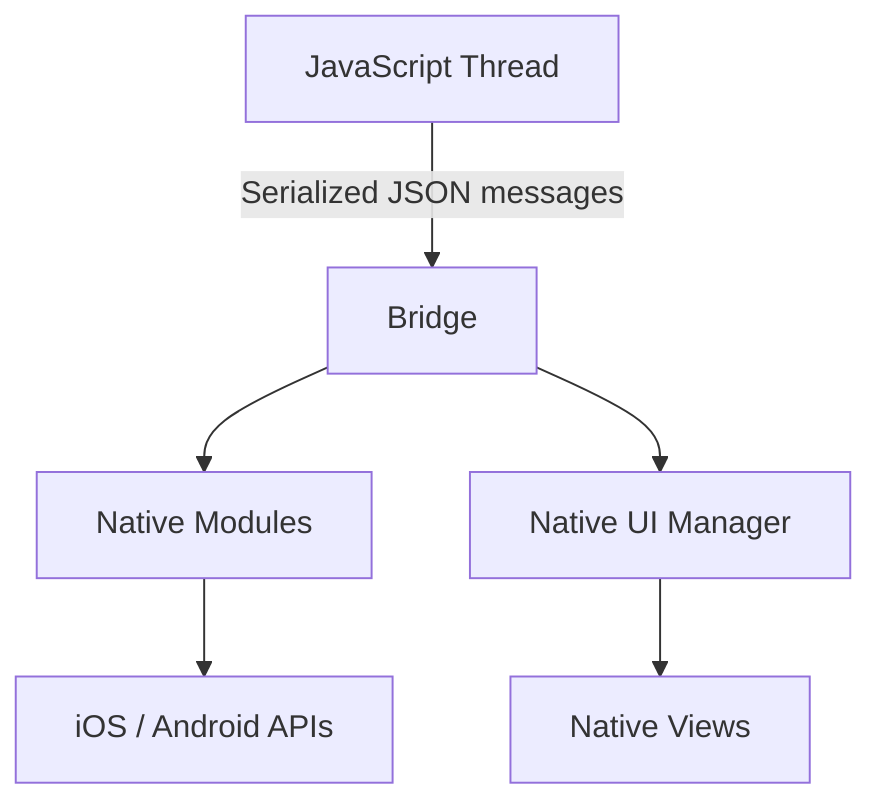
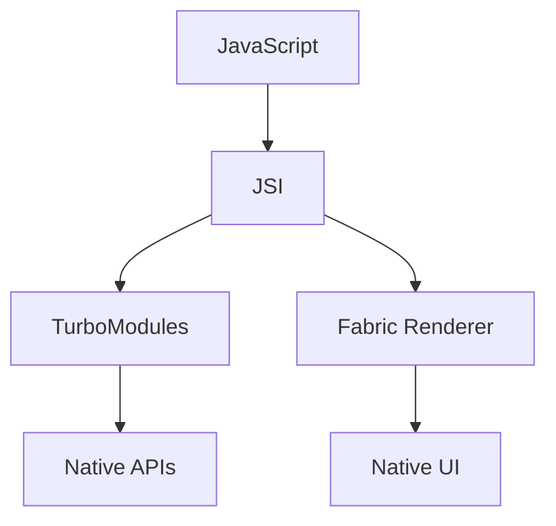
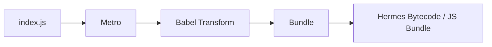
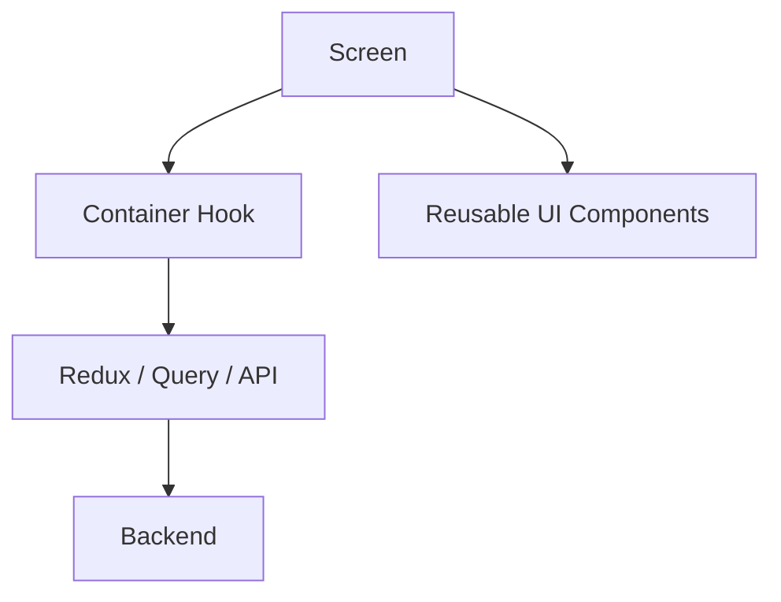
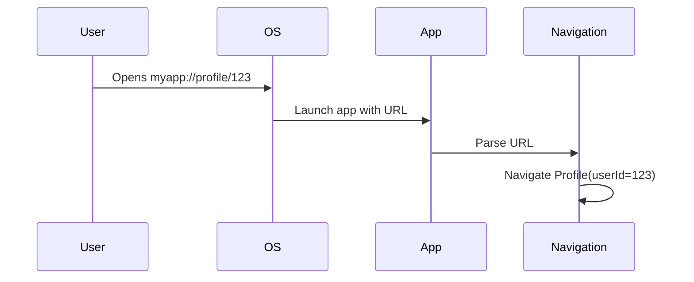
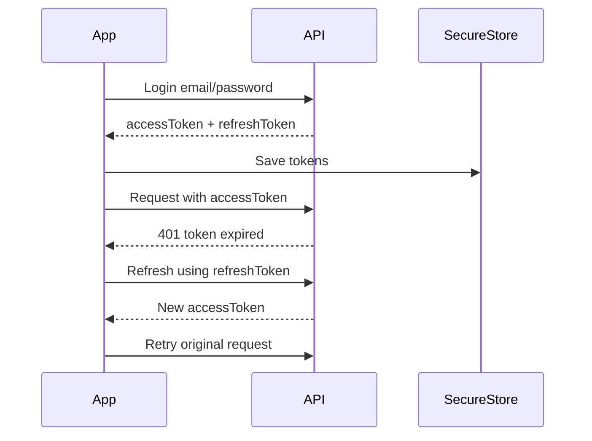
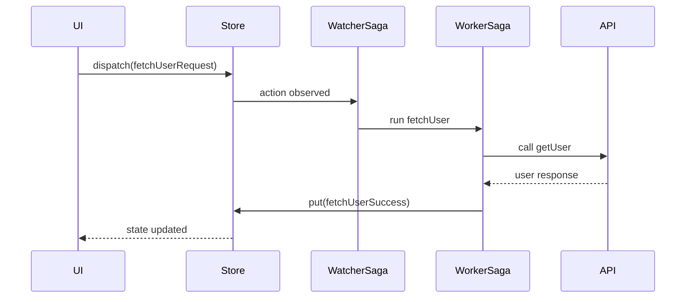
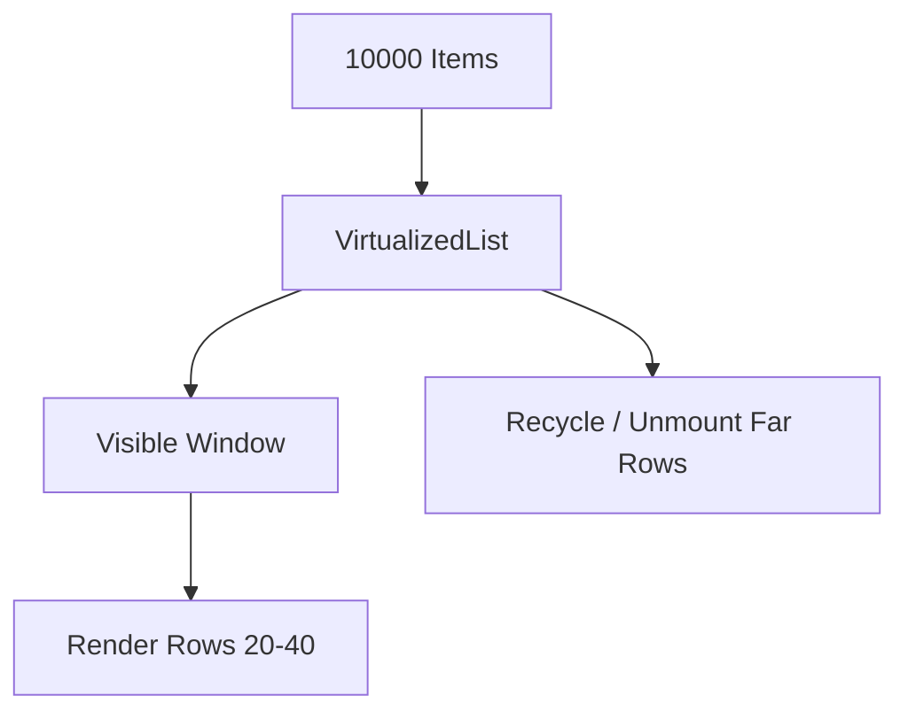

# React Native Senior Developer Handbook - Volume 2
## React Native Core, UI, Networking, Redux, Saga, FlatList, Navigation

> Goal: Refresh React Native production concepts like a senior developer:
> UI building, networking, Redux/Saga, FlatList, architecture, environment configs, accessibility, and real interview explanations.

---

# Table of Contents

1. [React Native Mental Model](#1-react-native-mental-model)
2. [React Native Architecture](#2-react-native-architecture)
3. [New Architecture (JSI, TurboModules, Fabric)](#3-new-architecture)
4. [Metro Bundler](#4-metro-bundler)
5. [Hermes](#5-hermes)
6. [Core Components](#6-core-components)
7. [Styling and Layout](#7-styling-and-layout)
8. [Reusable Component Design](#8-reusable-component-design)
9. [Screen Architecture](#9-screen-architecture)
10. [Navigation](#10-navigation)
11. [API Layer Design](#11-api-layer-design)
12. [Auth Token Flow](#12-auth-token-flow)
13. [Redux From Scratch](#13-redux-from-scratch)
14. [Redux Toolkit](#14-redux-toolkit)
15. [Redux Saga](#15-redux-saga)
16. [FlatList Deep Dive](#16-flatlist-deep-dive)
17. [Pagination](#17-pagination)
18. [Pull To Refresh](#18-pull-to-refresh)
19. [Environment Configurations](#19-environment-configurations)
20. [Accessibility](#20-accessibility)
21. [Production Folder Structure](#21-production-folder-structure)
22. [Interview Questions](#22-interview-questions)

---

# 1. React Native Mental Model

React Native lets us write UI using React, but the final UI is native.

```txt
React Component
    ↓
React Native Renderer
    ↓
Native iOS UIView / Android View
```

Example:

```tsx
<View>
  <Text>Hello</Text>
</View>
```

On iOS this becomes native views.  
On Android this becomes native views.

Senior explanation:

> React Native is not a WebView. It uses React to describe UI, then maps that UI to native platform components.

---

# 2. React Native Architecture

## Old Architecture



Problems:

- Bridge communication is asynchronous.
- Data is serialized.
- Heavy traffic can slow down performance.
- Too many native calls can block UI responsiveness.

Example problem:

```tsx
for (let i = 0; i < 1000; i++) {
  NativeModules.Logger.log(`event-${i}`);
}
```

This sends too many bridge messages.

Better:

```tsx
NativeModules.Logger.logBatch(events);
```

---

# 3. New Architecture



## JSI

JSI means JavaScript Interface.

Instead of sending serialized JSON through a bridge, JS can communicate more directly with native C++/platform code.

Senior explanation:

> JSI is the foundation for the new architecture. It enables direct communication between JS and native, making native modules and rendering more efficient.

## TurboModules

Old native modules were often loaded at startup.

TurboModules are lazy loaded.

```txt
App Start
  ↓
Only required native modules loaded
  ↓
Better startup time
```

## Fabric

Fabric is the new rendering system.

Benefits:

- Better rendering performance.
- Synchronous layout capabilities.
- Works better with concurrent React.

---

**Interview summary for New Architecture:**

> The old architecture serialized all JS-to-native communication as JSON through an async bridge. This caused bottlenecks under heavy traffic. The new architecture introduces JSI (JavaScript Interface), which lets JS call C++ native code directly without serialization. TurboModules lazy-load native modules only when needed, improving startup time. Fabric is the new renderer that supports synchronous layout and concurrent React features.

---

# 4. Metro Bundler

Metro bundles JavaScript for React Native.



Metro handles:

- TypeScript/JavaScript transform
- Module resolution
- Assets
- Fast Refresh
- Source maps

Common Metro issue:

```bash
error Unable to resolve module
```

Fix checklist:

```bash
watchman watch-del-all
rm -rf node_modules
rm -rf /tmp/metro-*
npm install
npx react-native start --reset-cache
```

---

# 5. Hermes

Hermes is a JavaScript engine optimized for React Native.

Benefits:

- Faster startup
- Lower memory usage
- Bytecode execution
- Better low-end Android performance

Check Hermes:

```tsx
const isHermes = !!global.HermesInternal;
console.log("Hermes enabled:", isHermes);
```

Senior interview answer:

> Hermes improves startup because JavaScript is precompiled into bytecode. This avoids expensive parsing during app launch.

---

# 6. Core Components

## View

```tsx
<View style={styles.container}>
  <Text>Hello</Text>
</View>
```

## Text

```tsx
<Text numberOfLines={2}>
  Long title
</Text>
```

## Pressable

Prefer `Pressable` over old `TouchableOpacity` for modern apps.

```tsx
<Pressable
  onPress={onSubmit}
  accessibilityRole="button"
  style={({ pressed }) => [
    styles.button,
    pressed && styles.buttonPressed,
  ]}
>
  <Text>Submit</Text>
</Pressable>
```

## TextInput

```tsx
const [email, setEmail] = useState("");

<TextInput
  value={email}
  onChangeText={setEmail}
  placeholder="Email"
  keyboardType="email-address"
  autoCapitalize="none"
/>
```

---

# 7. Styling and Layout

React Native uses Yoga layout engine.

Default flex direction is `column`.

```tsx
const styles = StyleSheet.create({
  container: {
    flex: 1,
    padding: 16,
  },
  row: {
    flexDirection: "row",
    alignItems: "center",
    justifyContent: "space-between",
  },
});
```

## Common Senior Layout Bug

Bad:

```tsx
<View style={{ height: "100%" }}>
```

Better:

```tsx
<View style={{ flex: 1 }}>
```

Why?

> `flex: 1` lets the component participate properly in parent layout. Fixed or percentage heights often break inside nested containers.

---

# 8. Reusable Component Design

Bad component:

```tsx
function PrimaryButton({ title, onPress }) {
  return (
    <Pressable onPress={onPress}>
      <Text>{title}</Text>
    </Pressable>
  );
}
```

Better:

```tsx
type PrimaryButtonProps = {
  title: string;
  onPress: () => void;
  disabled?: boolean;
  loading?: boolean;
  accessibilityLabel?: string;
};

export function PrimaryButton({
  title,
  onPress,
  disabled = false,
  loading = false,
  accessibilityLabel,
}: PrimaryButtonProps) {
  return (
    <Pressable
      disabled={disabled || loading}
      onPress={onPress}
      accessibilityRole="button"
      accessibilityLabel={accessibilityLabel ?? title}
      style={({ pressed }) => [
        styles.button,
        disabled && styles.disabled,
        pressed && styles.pressed,
      ]}
    >
      <Text style={styles.title}>
        {loading ? "Loading..." : title}
      </Text>
    </Pressable>
  );
}
```

Senior mindset:

- Accept controlled props.
- Support accessibility.
- Support disabled/loading.
- Avoid business logic inside dumb UI components.

---

# 9. Screen Architecture



Example:

```tsx
export function UserProfileScreen() {
  const {
    user,
    isLoading,
    error,
    onRefresh,
  } = useUserProfile();

  if (isLoading) return <LoadingView />;

  if (error) return <ErrorView message={error} onRetry={onRefresh} />;

  return (
    <UserProfileView
      user={user}
      onRefresh={onRefresh}
    />
  );
}
```

Container hook:

```tsx
function useUserProfile() {
  const dispatch = useDispatch();
  const user = useSelector(selectUser);
  const isLoading = useSelector(selectUserLoading);
  const error = useSelector(selectUserError);

  useEffect(() => {
    dispatch(userActions.fetchUserRequest());
  }, [dispatch]);

  const onRefresh = useCallback(() => {
    dispatch(userActions.fetchUserRequest());
  }, [dispatch]);

  return {
    user,
    isLoading,
    error,
    onRefresh,
  };
}
```

---

# 10. Navigation

Common libraries:

- React Navigation
- Native Stack
- Bottom Tabs
- Drawer

Example:

```tsx
import { createNativeStackNavigator } from "@react-navigation/native-stack";

export type RootStackParamList = {
  Home: undefined;
  Profile: { userId: string };
};

const Stack = createNativeStackNavigator<RootStackParamList>();

export function AppNavigator() {
  return (
    <Stack.Navigator>
      <Stack.Screen name="Home" component={HomeScreen} />
      <Stack.Screen name="Profile" component={ProfileScreen} />
    </Stack.Navigator>
  );
}
```

Typed navigation:

```tsx
type Props = NativeStackScreenProps<RootStackParamList, "Profile">;

export function ProfileScreen({ route }: Props) {
  const { userId } = route.params;

  return <Text>{userId}</Text>;
}
```

## Deep Linking

```tsx
const linking = {
  prefixes: ["myapp://", "https://myapp.com"],
  config: {
    screens: {
      Home: "home",
      Profile: "profile/:userId",
    },
  },
};
```

Flow:



---

# 11. API Layer Design

Bad:

```tsx
useEffect(() => {
  fetch("https://api.example.com/users");
}, []);
```

Better:

```txt
Screen
  ↓
Hook / Saga
  ↓
Service
  ↓
API Client
```

API client:

> 📖 **Note**: Vol 1 §12 shows a simplified error-handling version of this wrapper. This is the full production version with method support, auth headers, and body serialization.

```ts
type RequestOptions = {
  method?: "GET" | "POST" | "PUT" | "DELETE";
  body?: unknown;
  token?: string;
};

export async function request<T>(
  path: string,
  options: RequestOptions = {}
): Promise<T> {
  const response = await fetch(`${Config.API_URL}${path}`, {
    method: options.method ?? "GET",
    headers: {
      "Content-Type": "application/json",
      ...(options.token ? { Authorization: `Bearer ${options.token}` } : {}),
    },
    body: options.body ? JSON.stringify(options.body) : undefined,
  });

  if (!response.ok) {
    throw new Error(`Request failed: ${response.status}`);
  }

  return response.json();
}
```

User service:

```ts
export type User = {
  id: string;
  name: string;
  email: string;
};

export const userService = {
  getUser(id: string, token: string) {
    return request<User>(`/users/${id}`, { token });
  },
};
```

---

# 12. Auth Token Flow



Token storage:

```ts
import * as Keychain from "react-native-keychain";

export async function saveTokens(accessToken: string, refreshToken: string) {
  await Keychain.setGenericPassword("tokens", JSON.stringify({
    accessToken,
    refreshToken,
  }));
}
```

## Token Refresh Interceptor

When a request gets a `401`, pause, refresh the token once, then retry:

```ts
let isRefreshing = false;
let pendingRequests: (() => void)[] = [];

export async function requestWithAuth<T>(
  path: string,
  options: RequestOptions = {}
): Promise<T> {
  const tokens = await getTokens();

  const response = await fetch(`${Config.API_URL}${path}`, {
    method: options.method ?? "GET",
    headers: {
      "Content-Type": "application/json",
      Authorization: `Bearer ${tokens.accessToken}`,
    },
    body: options.body ? JSON.stringify(options.body) : undefined,
  });

  if (response.status === 401) {
    if (!isRefreshing) {
      isRefreshing = true;

      try {
        const newTokens = await authService.refresh(tokens.refreshToken);
        await saveTokens(newTokens.accessToken, newTokens.refreshToken);

        // Replay all queued requests
        pendingRequests.forEach(resolve => resolve());
        pendingRequests = [];
      } catch {
        // Refresh failed — logout user
        await authService.logout();
        throw new Error("Session expired");
      } finally {
        isRefreshing = false;
      }
    } else {
      // Another refresh already in-flight — queue and retry
      await new Promise<void>(resolve => pendingRequests.push(resolve));
    }

    // Retry original request with new token
    return requestWithAuth<T>(path, options);
  }

  if (!response.ok) {
    throw new Error(`Request failed: ${response.status}`);
  }

  return response.json();
}
```

Senior warning:

> Do not store sensitive tokens in AsyncStorage unless your security requirements allow it. Prefer Keychain/Keystore-backed storage.

---

# 13. Redux From Scratch

Redux idea:

```txt
Action → Reducer → New State → UI Update
```

Minimal Redux:

```ts
type Action = {
  type: string;
  payload?: unknown;
};

type Listener = () => void;

function createStore<State>(
  reducer: (state: State, action: Action) => State,
  initialState: State
) {
  let state = initialState;
  const listeners: Listener[] = [];

  return {
    getState() {
      return state;
    },

    dispatch(action: Action) {
      state = reducer(state, action);
      listeners.forEach(listener => listener());
    },

    subscribe(listener: Listener) {
      listeners.push(listener);

      return () => {
        const index = listeners.indexOf(listener);
        listeners.splice(index, 1);
      };
    },
  };
}
```

Reducer:

```ts
type CounterState = {
  count: number;
};

function counterReducer(
  state: CounterState = { count: 0 },
  action: Action
): CounterState {
  switch (action.type) {
    case "increment":
      return {
        ...state,
        count: state.count + 1,
      };

    default:
      return state;
  }
}
```

---

# 14. Redux Toolkit

Slice:

```ts
import { createSlice, PayloadAction } from "@reduxjs/toolkit";

type UserState = {
  user: User | null;
  isLoading: boolean;
  error: string | null;
};

const initialState: UserState = {
  user: null,
  isLoading: false,
  error: null,
};

const userSlice = createSlice({
  name: "user",
  initialState,
  reducers: {
    fetchUserRequest(state) {
      state.isLoading = true;
      state.error = null;
    },
    fetchUserSuccess(state, action: PayloadAction<User>) {
      state.isLoading = false;
      state.user = action.payload;
    },
    fetchUserFailure(state, action: PayloadAction<string>) {
      state.isLoading = false;
      state.error = action.payload;
    },
  },
});

export const userActions = userSlice.actions;
export const userReducer = userSlice.reducer;
```

Important:

Redux Toolkit uses Immer internally, so this is okay:

```ts
state.isLoading = true;
```

It still creates immutable updates.

---

# 15. Redux Saga

Saga flow:



Watcher:

```ts
import { takeLatest } from "redux-saga/effects";

export function* userWatcherSaga() {
  yield takeLatest(userActions.fetchUserRequest.type, fetchUserSaga);
}
```

Worker:

```ts
import { call, put, select } from "redux-saga/effects";

function* fetchUserSaga(
  action: ReturnType<typeof userActions.fetchUserRequest>
) {
  try {
    const token: string = yield select(selectAccessToken);

    const user: User = yield call(
      userService.getUser,
      action.payload.userId,
      token
    );

    yield put(userActions.fetchUserSuccess(user));
  } catch (error) {
    yield put(userActions.fetchUserFailure("Unable to load user"));
  }
}
```

## takeLatest vs takeEvery

```txt
takeLatest:
Search box, refresh profile, latest result matters.

takeEvery:
Analytics events, logging, independent background actions.
```

Example:

```ts
yield takeLatest(searchActions.searchRequest.type, searchSaga);
yield takeEvery(analyticsActions.trackEvent.type, trackEventSaga);
```

## Saga Parallel Calls

```ts
import { all, call } from "redux-saga/effects";

function* loadDashboardSaga() {
  const [profile, accounts, notifications] = yield all([
    call(api.getProfile),
    call(api.getAccounts),
    call(api.getNotifications),
  ]);

  yield put(dashboardActions.loadSuccess({
    profile,
    accounts,
    notifications,
  }));
}
```

## Saga Race

```ts
import { call, race, delay } from "redux-saga/effects";

function* loadWithTimeout() {
  const { response, timeout } = yield race({
    response: call(api.getUser),
    timeout: delay(5000),
  });

  if (timeout) {
    yield put(userActions.fetchUserFailure("Request timed out"));
    return;
  }

  yield put(userActions.fetchUserSuccess(response));
}
```

---

# 16. FlatList Deep Dive

FlatList is built on VirtualizedList.

It does not render all rows at once.



Bad:

```tsx
<ScrollView>
  {items.map(item => (
    <Item item={item} />
  ))}
</ScrollView>
```

Good:

```tsx
<FlatList
  data={items}
  keyExtractor={(item) => item.id}
  renderItem={({ item }) => <Item item={item} />}
/>
```

## Production FlatList

```tsx
type Product = {
  id: string;
  title: string;
  price: number;
};

const ProductRow = React.memo(function ProductRow({
  item,
  onPress,
}: {
  item: Product;
  onPress: (id: string) => void;
}) {
  return (
    <Pressable onPress={() => onPress(item.id)} style={styles.row}>
      <Text>{item.title}</Text>
      <Text>${item.price}</Text>
    </Pressable>
  );
});

export function ProductListScreen() {
  const [products, setProducts] = useState<Product[]>([]);
  const [page, setPage] = useState(1);
  const [isLoadingMore, setIsLoadingMore] = useState(false);

  const loadMore = useCallback(async () => {
    if (isLoadingMore) return;

    setIsLoadingMore(true);

    const nextProducts = await productService.getProducts(page + 1);

    setProducts(prev => [...prev, ...nextProducts]);
    setPage(prev => prev + 1);
    setIsLoadingMore(false);
  }, [isLoadingMore, page]);

  const onPressProduct = useCallback((id: string) => {
    console.log("Open product", id);
  }, []);

  const renderItem = useCallback(
    ({ item }: { item: Product }) => (
      <ProductRow item={item} onPress={onPressProduct} />
    ),
    [onPressProduct]
  );

  return (
    <FlatList
      data={products}
      keyExtractor={(item) => item.id}
      renderItem={renderItem}
      onEndReached={loadMore}
      onEndReachedThreshold={0.5}
      initialNumToRender={10}
      maxToRenderPerBatch={10}
      windowSize={7}
      removeClippedSubviews
      ListFooterComponent={isLoadingMore ? <ActivityIndicator /> : null}
    />
  );
}
```

## Important Props

| Prop | Why it matters |
|---|---|
| `initialNumToRender` | First batch size |
| `maxToRenderPerBatch` | Controls render batch size |
| `windowSize` | Number of screens worth of content |
| `getItemLayout` | Avoids layout measurement for fixed-height rows |
| `removeClippedSubviews` | Removes offscreen native views |
| `keyExtractor` | Stable identity for reconciliation |

Fixed height optimization:

```tsx
const ITEM_HEIGHT = 72;

<FlatList
  data={items}
  getItemLayout={(_, index) => ({
    length: ITEM_HEIGHT,
    offset: ITEM_HEIGHT * index,
    index,
  })}
/>
```

---

# 17. Pagination

## Offset Pagination

```txt
/users?page=1&limit=20
/users?page=2&limit=20
```

Problem:

If new records are inserted, pages can shift.

## Cursor Pagination

```txt
/users?cursor=abc123&limit=20
```

Better for mobile feeds.

```ts
type PaginatedResponse<T> = {
  data: T[];
  nextCursor?: string;
  hasMore: boolean;
};
```

Implementation:

```tsx
const [cursor, setCursor] = useState<string | undefined>();
const [hasMore, setHasMore] = useState(true);

const loadMore = async () => {
  if (!hasMore) return;

  const response = await api.getFeed({ cursor });

  setItems(prev => [...prev, ...response.data]);
  setCursor(response.nextCursor);
  setHasMore(response.hasMore);
};
```

---

# 18. Pull To Refresh

```tsx
const [refreshing, setRefreshing] = useState(false);

const onRefresh = useCallback(async () => {
  setRefreshing(true);
  const latest = await feedService.getFeed();
  setItems(latest);
  setRefreshing(false);
}, []);

<FlatList
  data={items}
  refreshing={refreshing}
  onRefresh={onRefresh}
  renderItem={renderItem}
/>
```

---

# 19. Environment Configurations

```txt
dev     → dev API
qa      → QA API
staging → staging API
prod    → production API
```

Example:

```ts
type AppConfig = {
  apiUrl: string;
  enableAnalytics: boolean;
};

export const Config: AppConfig = {
  apiUrl: process.env.API_URL ?? "https://api.example.com",
  enableAnalytics: process.env.ENABLE_ANALYTICS === "true",
};
```

Never do:

```ts
const API_URL = "https://prod-api.com";
```

Senior explanation:

> Mobile apps need separate environments because builds are distributed and cannot be changed instantly like web deployments.

---

# 20. Accessibility

Button:

```tsx
<Pressable
  accessibilityRole="button"
  accessibilityLabel="Submit payment"
  accessibilityHint="Submits the current payment form"
  onPress={onSubmit}
>
  <Text>Submit</Text>
</Pressable>
```

Decorative image:

```tsx
<Image
  source={logo}
  accessible={false}
  importantForAccessibility="no"
/>
```

Common Android TalkBack issue:

```tsx
<View accessible>
  <Text>Title</Text>
  <Pressable>
    <Text>Button</Text>
  </Pressable>
</View>
```

Problem:

Parent may steal accessibility focus.

Better:

```tsx
<View accessible={false}>
  <Text accessibilityRole="header">Title</Text>
  <Pressable accessibilityRole="button">
    <Text>Button</Text>
  </Pressable>
</View>
```

---

# 21. Production Folder Structure

```txt
src/
  app/
    App.tsx
    providers/
  navigation/
    RootNavigator.tsx
    linking.ts
  screens/
    Home/
      HomeScreen.tsx
      useHome.ts
      HomeView.tsx
      styles.ts
  components/
    Button/
    Card/
    EmptyState/
  store/
    index.ts
    rootReducer.ts
    rootSaga.ts
  features/
    user/
      userSlice.ts
      userSaga.ts
      userSelectors.ts
      userService.ts
      userTypes.ts
  services/
    apiClient.ts
    authService.ts
  hooks/
  utils/
  theme/
  types/
```

Senior note:

> Feature-based folders scale better than dumping everything into global components/services folders.

---

# 22. Interview Questions

## How does FlatList optimization work internally?

FlatList uses VirtualizedList. It renders only a window of visible rows plus buffer rows. It avoids mounting thousands of views at once. Performance depends on stable keys, memoized rows, good batch sizes, and avoiding expensive renderItem logic.

## ScrollView vs FlatList?

ScrollView renders all children immediately. FlatList virtualizes rows and is better for large datasets.

## Why use Redux Saga?

Saga is useful when async business logic becomes complex: cancellation, retries, sequencing, parallel calls, race conditions, background sync, and analytics.

## Redux Toolkit vs old Redux?

Redux Toolkit reduces boilerplate, uses Immer for immutable updates, and is the recommended modern Redux style.

## Context vs Redux?

Context is good for low-frequency global state like theme, locale, auth session. Redux is better for complex, high-frequency, business-critical state with debugging, middleware, and predictable flows.

## What causes RN performance problems?

- Large JS work on JS thread
- Non-memoized list rows
- Huge images
- Too many re-renders
- Expensive renderItem
- Large bridge traffic
- Poor pagination
- Unoptimized animations