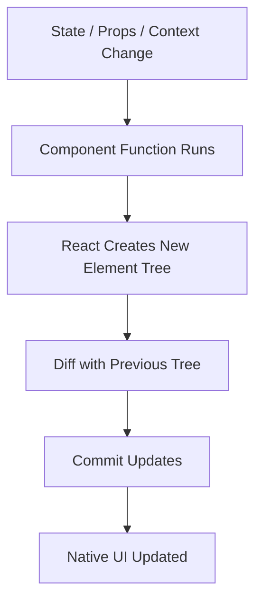
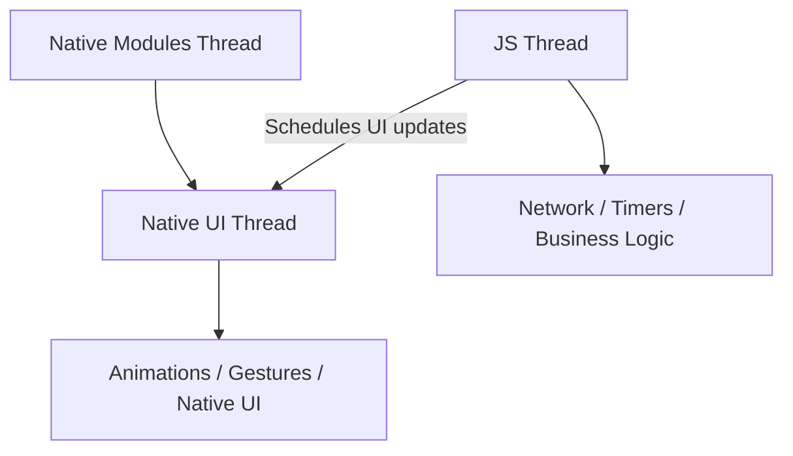
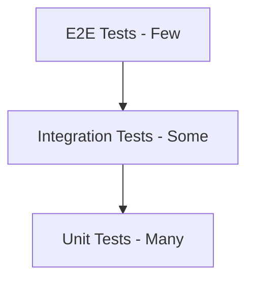
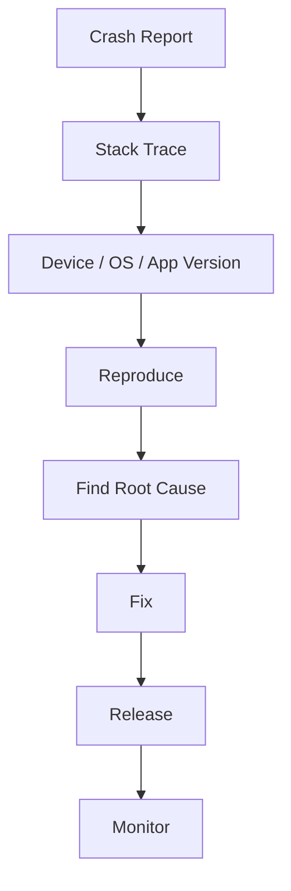
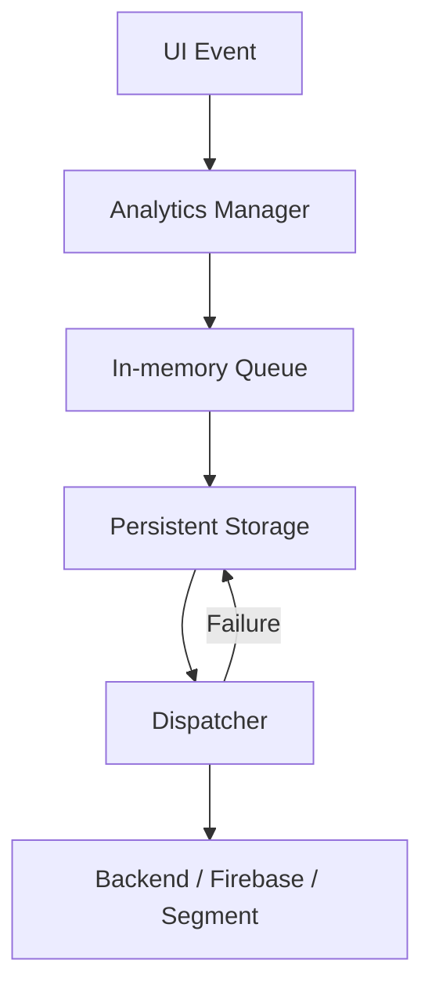
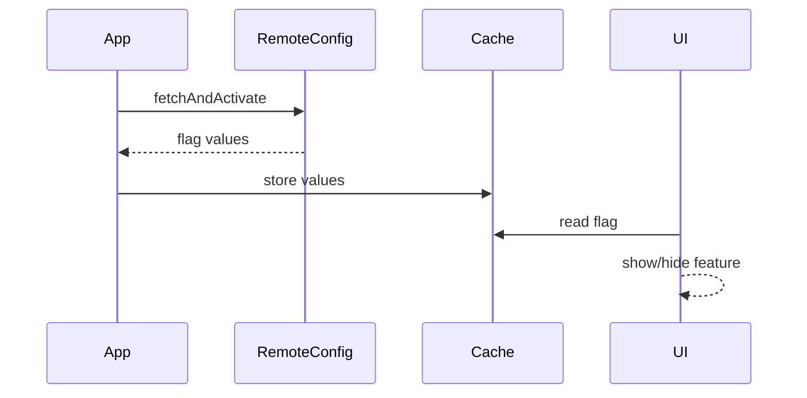
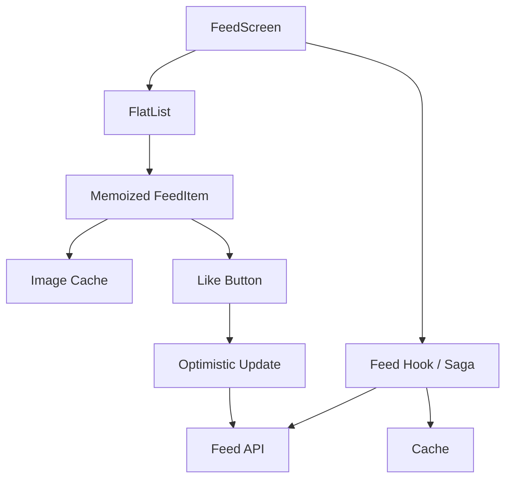
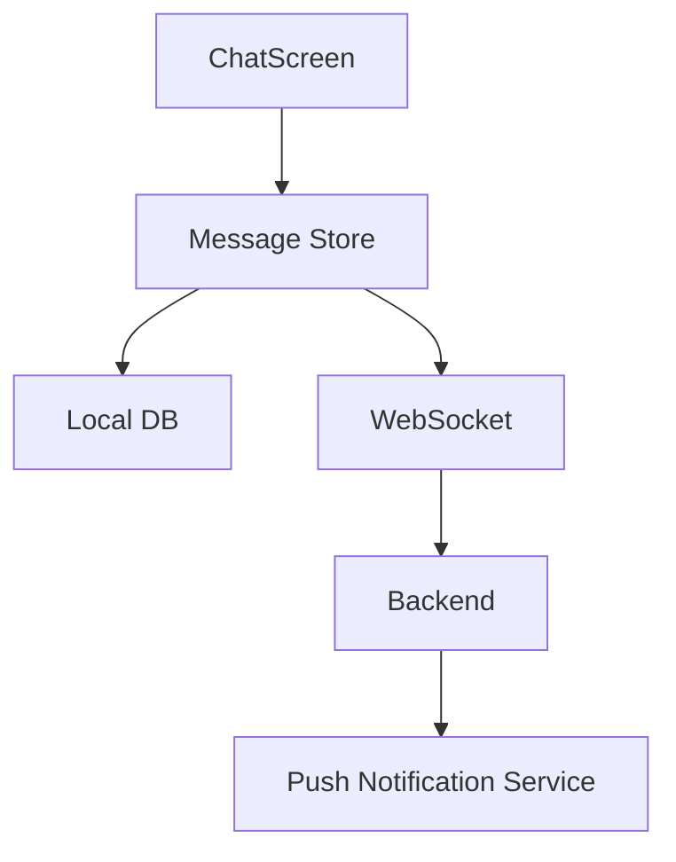

# React Native Senior Developer Handbook - Volume 3
## Performance, Testing, Debugging, Threads, System Design, Senior Interviews

> Goal: Prepare for senior React Native interviews and production debugging:
> performance, hooks, rendering, tests, memory leaks, native threads, system design, analytics SDK, auth, crash debugging.

---

# Table of Contents

1. React Rendering Refresher
2. Why Re-renders Happen
3. useMemo vs useCallback
4. React.memo
5. useRef
6. Rendering Debugging
7. Memory Leaks
8. RN Threading Model
9. Animation Performance
10. Image Performance
11. Testing Strategy
12. Jest
13. React Native Testing Library
14. Saga Testing
15. Detox E2E
16. Crash Debugging
17. Production Logging
18. Analytics SDK Design
19. Feature Flags
20. Mobile System Design - Instagram Feed
21. Mobile System Design - Chat App
22. Backend Mistakes That Hurt Mobile
23. Senior Interview Q&A

---

# 1. React Rendering Refresher

> 📖 **Foundation covered in Vol 1 §36** — this section focuses on the performance implications. For the conceptual model (what rendering IS and how reconciliation works), see Vol 1 Section 36.

Render cycle quick recap:



Key performance insight:

> A render does not always mean native UI changed. React can render, compare, and decide nothing needs to commit. **Unnecessary renders cost CPU time but don’t always cause visual changes — the goal is to eliminate renders where the output would be identical.**

---

# 2. Why Re-renders Happen

> 📖 **Concept in Vol 1 §36** — this section is about diagnosing and fixing unnecessary re-renders in production.

Common causes:

```txt
1. Local state changes
2. Parent component renders
3. Context value changes
4. Redux selector returns new reference
5. Inline objects/functions passed to children
```

Bad:

```tsx
<UserCard
  user={user}
  style={{ margin: 16 }}
  onPress={() => openUser(user.id)}
/>
```

Why bad?

- New style object every render.
- New function every render.
- Memoized child may still re-render.

Better:

```tsx
const cardStyle = useMemo(() => ({ margin: 16 }), []);

const onPressUser = useCallback(() => {
  openUser(user.id);
}, [openUser, user.id]);

<UserCard
  user={user}
  style={cardStyle}
  onPress={onPressUser}
/>
```

Senior warning:

> Do not use useMemo/useCallback everywhere. Use them when child memoization or expensive computation actually matters.

---

# 3. useMemo vs useCallback — When to Actually Use Them

> 📖 **Definitions and syntax in Vol 1 §31 & §32** — this section covers the decision: when do they actually help, and when are they wasted?

## useMemo — When it helps

```tsx
// ✅ Good: expensive filter on large list
const filteredUsers = useMemo(() => {
  return users.filter(user => user.isActive);
}, [users]);

// ✅ Good: stable reference for memoized child
const config = useMemo(() => ({ timeout: 3000 }), []);

// ❌ Bad: cheap property access, no benefit
const name = useMemo(() => user.name, [user.name]);
```

## useCallback — When it helps

```tsx
// ✅ Good: passed to React.memo child, prevents re-render
const onPressUser = useCallback((id: string) => {
  navigation.navigate("Profile", { userId: id });
}, [navigation]);

// ❌ Bad: child is not memoized, so useCallback doesn't prevent anything
function Parent() {
  const onClick = useCallback(() => doThing(), []); // pointless if Child isn't memoized
  return <Child onClick={onClick} />;
}
```

## Decision guide

```txt
Is the computation expensive OR is it a reference passed to React.memo child?
  YES → Use useMemo / useCallback
  NO  → Skip it. It adds overhead too.
```

Relationship:

```tsx
useCallback(fn, deps)
// is the same as:
useMemo(() => fn, deps)
```

Interview answer:

> useMemo is for memoizing computed values. useCallback is for memoizing function references, commonly passed to memoized children. Do not use either indiscriminately — they have their own overhead.

---

# 4. React.memo

```tsx
type Props = {
  title: string;
  onPress: () => void;
};

function Row({ title, onPress }: Props) {
  console.log("Row rendered");

  return (
    <Pressable onPress={onPress}>
      <Text>{title}</Text>
    </Pressable>
  );
}

export default React.memo(Row);
```

When it helps:

- List rows
- Expensive components
- Stable props

When it does not help:

```tsx
<Row onPress={() => doSomething()} />
```

Because function prop changes every render.

---

# 5. useRef — Performance Use Cases

> 📖 **Full useRef reference in Vol 1 §33** — including timer IDs, TextInput access, and the `useLatest` stale-closure fix. This section focuses on useRef for performance debugging.

`useRef` stores mutable value that does not trigger re-render.

## Track render count (debugging tool)

```tsx
const renderCount = useRef(0);

renderCount.current += 1;

// Log it:
console.log(`Rendered ${renderCount.current} times`);
```

## Store latest callback — avoid stale closure without adding deps

```tsx
const callbackRef = useRef(onPress);

useEffect(() => {
  callbackRef.current = onPress;
}, [onPress]);

useEffect(() => {
  const id = setInterval(() => {
    callbackRef.current(); // always fresh
  }, 1000);

  return () => clearInterval(id);
}, []); // no stale closure risk
```

Senior note:

> Refs are the escape hatch from React’s immutable render model. Useful for tracking values across renders without triggering new renders.

---

# 6. Rendering Debugging

Simple render logger custom hook:

```tsx
function useRenderLogger(name: string) {
  const count = useRef(0);

  count.current += 1;

  useEffect(() => {
    console.log(`${name} rendered ${count.current} times`);
  }); // ← no dep array: intentional! Runs after EVERY render to log every single time.
}
```

> ⚠️ **Why no dependency array?** This is intentional. An empty `[]` would only log on mount. By omitting the array entirely, the effect runs after *every* render — which is exactly what a render logger should do.
```

Usage:

```tsx
function ProductRow({ item }: { item: Product }) {
  useRenderLogger(`ProductRow-${item.id}`);

  return <Text>{item.title}</Text>;
}
```

Why Did You Render style issue:

```tsx
const user = {
  id: "1",
  name: "Nithin",
};
```

If created inside render, it is a new object every time.

Better:

```tsx
const user = useMemo(() => ({
  id: "1",
  name: "Nithin",
}), []);
```

---

# 7. Memory Leaks

## Timer Leak

Bad:

```tsx
useEffect(() => {
  setInterval(() => {
    fetchData();
  }, 1000);
}, []);
```

Good:

```tsx
useEffect(() => {
  const id = setInterval(() => {
    fetchData();
  }, 1000);

  return () => clearInterval(id);
}, []);
```

## API Response After Unmount

Bad:

```tsx
useEffect(() => {
  api.getUser().then(setUser);
}, []);
```

Good:

```tsx
useEffect(() => {
  let mounted = true;

  api.getUser().then(user => {
    if (mounted) {
      setUser(user);
    }
  });

  return () => {
    mounted = false;
  };
}, []);
```

Better with AbortController:

```tsx
useEffect(() => {
  const controller = new AbortController();

  fetch(url, { signal: controller.signal })
    .then(response => response.json())
    .then(setData)
    .catch(error => {
      if (error.name !== "AbortError") {
        setError(error);
      }
    });

  return () => controller.abort();
}, [url]);
```

---

# 8. RN Threading Model



## JS Thread

Responsible for:

- React render
- Business logic
- Redux
- Saga
- JSON parsing
- Event handlers

If JS thread is blocked:

- Button presses delayed
- Navigation lag
- List scrolling can feel bad
- JS-driven animations stutter

Bad:

```tsx
function expensiveWork() {
  for (let i = 0; i < 100000000; i++) {}
}
```

Better:

- Move heavy work to native.
- Chunk work.
- Use InteractionManager.
- Use optimized libraries.

```tsx
InteractionManager.runAfterInteractions(() => {
  expensiveButNonUrgentWork();
});
```

---

# 9. Animation Performance

Bad for heavy animations:

```tsx
Animated.timing(value, {
  toValue: 1,
  duration: 300,
  useNativeDriver: false,
}).start();
```

Better:

```tsx
Animated.timing(value, {
  toValue: 1,
  duration: 300,
  useNativeDriver: true,
}).start();
```

Why?

> Native driver sends animation config to native once, so animation can continue smoothly without JS thread involvement.

For modern apps:

- Reanimated
- Gesture Handler
- Native-driven animations

---

# 10. Image Performance

Common mistakes:

```tsx
<Image source={{ uri: hugeOriginalImage }} />
```

Problems:

- Huge downloads
- Memory spikes
- Slow rendering
- Janky lists

Better backend image API:

```txt
/image?id=123&w=300&h=300&format=webp
```

Better component:

```tsx
<Image
  source={{ uri: product.thumbnailUrl }}
  style={{ width: 80, height: 80 }}
  resizeMode="cover"
/>
```

List image checklist:

- Use thumbnails.
- Cache images.
- Avoid base64 images.
- Avoid huge original image URLs.
- Provide fixed dimensions.

---

# 11. Testing Strategy

Testing pyramid:



What to test:

| Area | Test Type |
|---|---|
| Reducers | Unit |
| Selectors | Unit |
| Sagas | Unit/Integration |
| Components | RNTL |
| Navigation flows | Integration/E2E |
| Login flow | E2E |
| API client | Unit with mocks |

---

# 12. Jest

Function:

```ts
export function calculateTotal(price: number, quantity: number): number {
  return price * quantity;
}
```

Test:

```ts
describe("calculateTotal", () => {
  it("returns price multiplied by quantity", () => {
    expect(calculateTotal(10, 3)).toBe(30);
  });
});
```

Async test:

```ts
it("loads user", async () => {
  api.getUser = jest.fn().mockResolvedValue({
    id: "1",
    name: "Nithin",
  });

  const user = await loadUser("1");

  expect(user.name).toBe("Nithin");
});
```

---

# 13. React Native Testing Library

Component:

```tsx
type Props = {
  title: string;
  onPress: () => void;
};

export function SaveButton({ title, onPress }: Props) {
  return (
    <Pressable accessibilityRole="button" onPress={onPress}>
      <Text>{title}</Text>
    </Pressable>
  );
}
```

Test:

```tsx
import { render, screen, fireEvent } from "@testing-library/react-native";

it("calls onPress when tapped", () => {
  const onPress = jest.fn();

  render(<SaveButton title="Save" onPress={onPress} />);

  fireEvent.press(screen.getByRole("button", { name: "Save" }));

  expect(onPress).toHaveBeenCalledTimes(1);
});
```

Screen test:

```tsx
it("shows loading state", () => {
  render(<UserProfileView isLoading user={null} error={null} />);

  expect(screen.getByText("Loading...")).toBeTruthy();
});
```

Senior rule:

> Test user-visible behavior, not internal implementation details.

---

# 14. Saga Testing

Using `testSaga` pattern:

Saga:

```ts
function* fetchUserSaga(action: ReturnType<typeof userActions.fetchUserRequest>) {
  const token: string = yield select(selectAccessToken);

  const user: User = yield call(
    userService.getUser,
    action.payload.userId,
    token
  );

  yield put(userActions.fetchUserSuccess(user));
}
```

Test:

```ts
import { testSaga } from "redux-saga-test-plan";

it("fetches user successfully", () => {
  const action = userActions.fetchUserRequest({ userId: "123" });
  const token = "access-token";
  const user = {
    id: "123",
    name: "Nithin",
    email: "nithin@test.com",
  };

  testSaga(fetchUserSaga, action)
    .next()
    .select(selectAccessToken)
    .next(token)
    .call(userService.getUser, "123", token)
    .next(user)
    .put(userActions.fetchUserSuccess(user))
    .next()
    .isDone();
});
```

Failure test:

```ts
it("handles fetch user failure", () => {
  const action = userActions.fetchUserRequest({ userId: "123" });
  const token = "access-token";
  const error = new Error("Network failed");

  testSaga(fetchUserSaga, action)
    .next()
    .select(selectAccessToken)
    .next(token)
    .call(userService.getUser, "123", token)
    .throw(error)
    .put(userActions.fetchUserFailure("Unable to load user"))
    .next()
    .isDone();
});
```

---

# 15. Detox E2E

Example flow:

```txt
Launch app
↓
Enter email
↓
Enter password
↓
Tap login
↓
Verify home screen
```

Test with proper setup and teardown:

```ts
describe("Login", () => {
  beforeAll(async () => {
    await device.launchApp({ newInstance: true });
  });

  afterAll(async () => {
    await device.terminateApp();
  });

  beforeEach(async () => {
    // Reset to clean state before each test
    await device.reloadReactNative();
  });

  it("logs in successfully", async () => {
    await element(by.id("emailInput")).typeText("test@example.com");
    await element(by.id("passwordInput")).typeText("password123");
    await element(by.id("loginButton")).tap();

    await expect(element(by.id("homeScreen"))).toBeVisible();
  });

  it("shows error for wrong password", async () => {
    await element(by.id("emailInput")).typeText("test@example.com");
    await element(by.id("passwordInput")).typeText("wrongpassword");
    await element(by.id("loginButton")).tap();

    await expect(element(by.id("loginError"))).toBeVisible();
  });
});
```

Senior note:

> E2E tests are expensive. Use them for critical business flows only.
>
> Use `beforeEach` + `device.reloadReactNative()` to reset state between tests. Use `beforeAll` for one-time setup (launching app) and `afterAll` for cleanup. Never rely on test order — each test should be independent.

---

# 16. Crash Debugging

Crash flow:



Tools:

- Firebase Crashlytics
- Sentry
- Bugsnag
- Xcode Organizer
- Play Console

Add breadcrumbs:

```ts
Sentry.addBreadcrumb({
  category: "navigation",
  message: "User opened ProfileScreen",
  level: "info",
});
```

Capture error:

```ts
try {
  await api.submitPayment();
} catch (error) {
  Sentry.captureException(error);
  throw error;
}
```

---

# 17. Production Logging

Bad:

```ts
console.log("token", token);
```

Never log secrets.

Better:

```ts
logger.info("Payment submit started", {
  paymentType: "credit_card",
  screen: "PaymentScreen",
});
```

Logger interface:

```ts
type LogLevel = "debug" | "info" | "warn" | "error";

type LogPayload = Record<string, string | number | boolean | undefined>;

class Logger {
  log(level: LogLevel, message: string, payload?: LogPayload) {
    if (__DEV__) {
      console.log(`[${level}] ${message}`, payload);
    }

    // Send to remote logging in production if needed
  }

  info(message: string, payload?: LogPayload) {
    this.log("info", message, payload);
  }

  error(message: string, payload?: LogPayload) {
    this.log("error", message, payload);
  }
}

export const logger = new Logger();
```

---

# 18. Analytics SDK Design

Architecture:



Event type:

```ts
type AnalyticsEvent = {
  name: string;
  properties?: Record<string, string | number | boolean>;
  timestamp: number;
};
```

Manager:

```ts
class AnalyticsManager {
  private queue: AnalyticsEvent[] = [];
  private isFlushing = false;

  track(name: string, properties?: AnalyticsEvent["properties"]) {
    const event: AnalyticsEvent = {
      name,
      properties,
      timestamp: Date.now(),
    };

    this.queue.push(event);
    this.persist();
  }

  async flush() {
    if (this.isFlushing || this.queue.length === 0) return;

    this.isFlushing = true;

    try {
      const events = [...this.queue];

      await analyticsApi.send(events);

      this.queue = [];
      await this.persist();
    } catch (error) {
      // keep events for retry
    } finally {
      this.isFlushing = false;
    }
  }

  private async persist() {
    await AsyncStorage.setItem(
      "analytics_queue",
      JSON.stringify(this.queue)
    );
  }
}
```

Senior considerations:

- Batch events.
- Retry on failure.
- Persist offline.
- Never block UI.
- Avoid PII.
- Flush on app background.

---

# 19. Feature Flags

Flow:



Type-safe flags:

```ts
type FeatureFlags = {
  newHomeScreen: boolean;
  enableNewPaymentFlow: boolean;
};

const defaultFlags: FeatureFlags = {
  newHomeScreen: false,
  enableNewPaymentFlow: false,
};

export function isFeatureEnabled(flag: keyof FeatureFlags): boolean {
  return featureFlagStore.get(flag) ?? defaultFlags[flag];
}
```

Usage:

```tsx
if (isFeatureEnabled("newHomeScreen")) {
  return <NewHomeScreen />;
}

return <OldHomeScreen />;
```

Senior note:

> Always define safe defaults. Remote config may fail or return stale values.

---

# 20. Mobile System Design - Instagram Feed

Requirements:

- Infinite scrolling feed
- Images/videos
- Like/unlike
- Comments
- Pull to refresh
- Offline cache
- Low-end device support

Architecture:



Feed item:

```ts
type FeedItem = {
  id: string;
  author: {
    id: string;
    name: string;
    avatarUrl: string;
  };
  imageUrl: string;
  caption: string;
  likedByMe: boolean;
  likeCount: number;
};
```

Optimistic like:

```ts
function toggleLikeOptimistic(item: FeedItem): FeedItem {
  const likedByMe = !item.likedByMe;

  return {
    ...item,
    likedByMe,
    likeCount: item.likeCount + (likedByMe ? 1 : -1),
  };
}
```

Saga:

```ts
function* likePostSaga(action: ReturnType<typeof feedActions.likePressed>) {
  const postId = action.payload.postId;

  yield put(feedActions.likeOptimistic(postId));

  try {
    yield call(feedService.likePost, postId);
  } catch (error) {
    yield put(feedActions.likeRollback(postId));
    yield put(feedActions.showToast("Unable to update like"));
  }
}
```

Senior tradeoff:

> Optimistic UI improves perceived performance, but you need rollback logic for failure.

---

# 21. Mobile System Design - Chat App

Requirements:

- Real-time messages
- Offline support
- Delivery status
- Push notifications
- Pagination
- Retry failed sends

Architecture:



Message model:

```ts
type MessageStatus = "sending" | "sent" | "delivered" | "failed";

type Message = {
  id: string;
  localId: string;
  conversationId: string;
  text: string;
  createdAt: string;
  status: MessageStatus;
};
```

Send message:

```ts
function* sendMessageSaga(action: ReturnType<typeof chatActions.sendMessage>) {
  const localMessage = createLocalMessage(action.payload.text);

  yield put(chatActions.messageAdded(localMessage));

  try {
    const serverMessage: Message = yield call(
      chatService.sendMessage,
      localMessage
    );

    yield put(chatActions.messageSendSuccess({
      localId: localMessage.localId,
      serverMessage,
    }));
  } catch (error) {
    yield put(chatActions.messageSendFailure(localMessage.localId));
  }
}
```

Senior points:

- Use local IDs before server IDs.
- Support retry.
- Store messages locally.
- Use cursor pagination for old messages.
- WebSocket for live messages.

---

# 22. Backend Mistakes That Hurt Mobile

Bad backend:

```json
{
  "items": [5000 records],
  "fullImageUrl": "20MB-image.jpg"
}
```

Mobile-friendly API:

```json
{
  "data": [],
  "nextCursor": "abc123",
  "hasMore": true
}
```

Backend should support:

- Pagination
- Filtering
- Compression
- Image resizing
- Caching headers
- Partial responses
- Stable IDs
- Idempotency for retry APIs

Idempotency example:

```ts
await api.post("/payments", {
  amount: 100,
  idempotencyKey: uuid(),
});
```

Why?

> Mobile networks fail. If the app retries payment submission, backend must avoid duplicate transactions.

---

# 23. Senior Interview Q&A

## Q1. What causes unnecessary re-renders?

State changes, parent renders, context updates, new object/function references, Redux selectors returning new references.

## Q2. How do you optimize a slow FlatList?

- Memoize row component.
- Memoize renderItem.
- Use stable keyExtractor.
- Use getItemLayout for fixed rows.
- Tune windowSize and maxToRenderPerBatch.
- Avoid heavy images.
- Avoid inline functions in rows.
- Paginate data.

## Q3. How does React Native threading work?

React Native has JS thread, UI thread, and native module threads. JS handles React rendering and business logic. UI thread handles native rendering and gestures. Heavy JS work can block user interactions.

## Q4. How would you debug production crashes?

Check crash tool, stack trace, device model, OS, app version, recent release changes, logs/breadcrumbs, reproduce locally, patch, release, monitor.

## Q5. How do you design an analytics SDK?

Create a manager that accepts events, validates them, queues them, persists offline, batches them, retries failed dispatches, avoids PII, and flushes during app lifecycle events.

## Q6. How do you handle auth refresh?

Use short-lived access tokens and long-lived refresh tokens. On 401, pause requests, refresh token once, retry failed requests, and logout if refresh fails.

## Q7. When do you use useMemo?

For expensive computed values or stable references passed to memoized children. Not for every simple calculation.

## Q8. When do you use useCallback?

When passing callbacks to memoized children or hooks that depend on stable function references.

## Q9. What is optimistic UI?

UI updates immediately before server confirmation. If API fails, rollback the UI.

## Q10. What makes a backend mobile-friendly?

Small payloads, pagination, compression, caching, stable IDs, image resizing, retry-safe APIs, and clear error contracts.